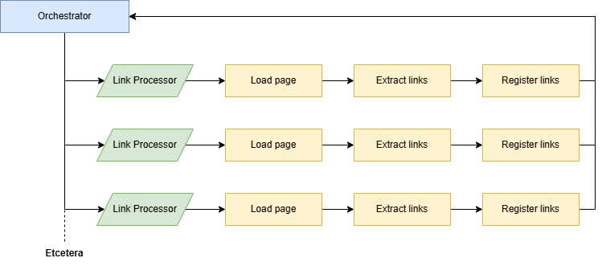

# Pre-implementation Analysis


## Task
A web crawler is required that will:
- accept a URL
- search the page loaded at the given URL for links
- repeat recursively for each found link
- create a structured output that details each visited URL and the contained links

*Per the project brief*:
> The crawler's scope should be limited to a single subdomain.

The crawler will default to operating within the `www` subdomain but will limit to a different subdomain if provided.

The web crawler must **not**:
- crawl links for external sites
- crawl links for any subdomains beside the default / provided
- crawl the same link more than once


## Constraints

**Budget**<br>
The budget allocated to this project is a comprehensive supply of hot drinks and emotional support snacks.

**External frameworks**<br>
External crawling frameworks are not to be used as this would negate the technical element of this exercise - no Ikea flat pack software!

**Performance**<br>
This program is expected to make performance based considerations - the faster the better!

**Test coverage**<br>
Test coverage isn't explicitly required in the initial brief, but is a sensible consideration. A blend of Behaviour Driven Development and Test Driven Development should be used:
- Identify behaviour
- Identify test criteria
- Develop solution
- Implement unit tests


## Development phases
**Initial analysis** [you are here]<br>
Pull concise requirements from the project brief.<br>
Add some technical looking fluff for authenticity.<br>
Establish development phases.<br>
Outline solution approach.

**Develop solution**<br>
Leverage the solution approach outline to develop the solution. This should follow Agile adjacent ways of working:
- implement module / feature
- test feature
- reflect - updating plans as necessary based on findings

**Prepare for the next project element**<br>
This analysis covers only the backend element of the system, further reports should be generated for the second project element: the frontend. This should include:
- Actionable plans
- A `feature -> Epic -> Task` approach
- Clear ACs and developer guidance
- Consideration for task sequencing and risks


## Initial solution approach
### Presentation
The backend will be written in Python (frankly, my least favourite programming language) because it's quick to set up and has very strong libraries and documentation that are handy for quick projects like this.

Ideally the project would be presented as an HTTP `POST` endpoint like `/krawler/crawl` that would accept the following JSON body:

```json
{
    "subdomain": "www", // optional
    "domain": "example-domain",
    "extension": ".co.uk"
}
```

And return the as-of-yet-unspecified response body specification.

*However*, in the interest of time it will instead be a command line application to be used as such:

```bash
python3 krawler.py -s www -h example-domain.co.uk
python3 krawler.py -s sub.domains -h example-domain.com
python3 krawler.py -h example-domain.co.uk  # if no subdomain is supplied 'www' is used as default
```

And will output the results to a timestamped JSON file.

### Structure



The main code will consist of 4 classes separated into individual scripts:
- `PageLoader` : Executes HTTP requests to access html files behind links
- `LinkRipper` : Iterates through html files to rip out any links
- `LinkProcessor` : Utilises instances of`PageLoader` and `LinkRipper` (from pooled resources) to:
    - Load the html behind the given URL
    - Extract contained links (and filter out unwanted links)
    - Register links with the orchestrator
- `Orchestrator` : Utilises instances of LinkProcessor (from pooled resources) to asynchronously process links - this is a class so that it can be passed to the `LinkProcessor` by reference for the `Register Links` callback.

### Link Ripping
In the interest of speed and memory usage, rather than using a HTML parser, it's better to iterate over the HTML file line by line and use regex to extract all instances matching the pattern: `'href=["|\'][^"\']*[^"|\']*["|\']'`.

There is a risk that an href could be point to a non HTML file (i.e. a download link) which should be mitigated through effective error handling in the page loader.

The ripper should store a collection of **all** links as well as a second collection of links that are withing the subdomain